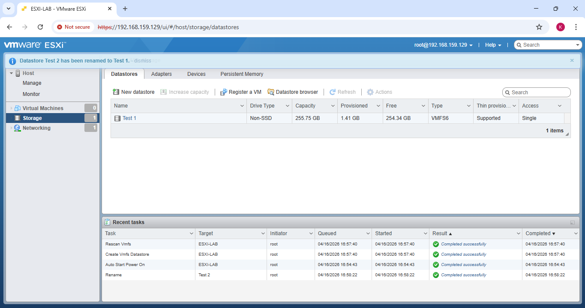
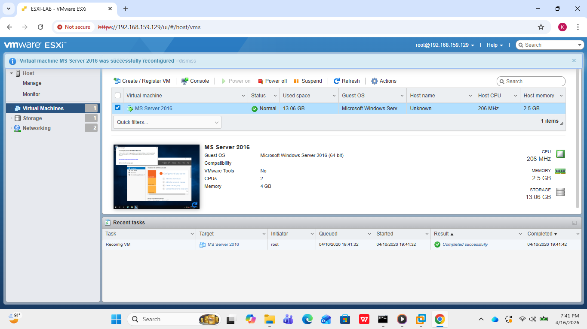
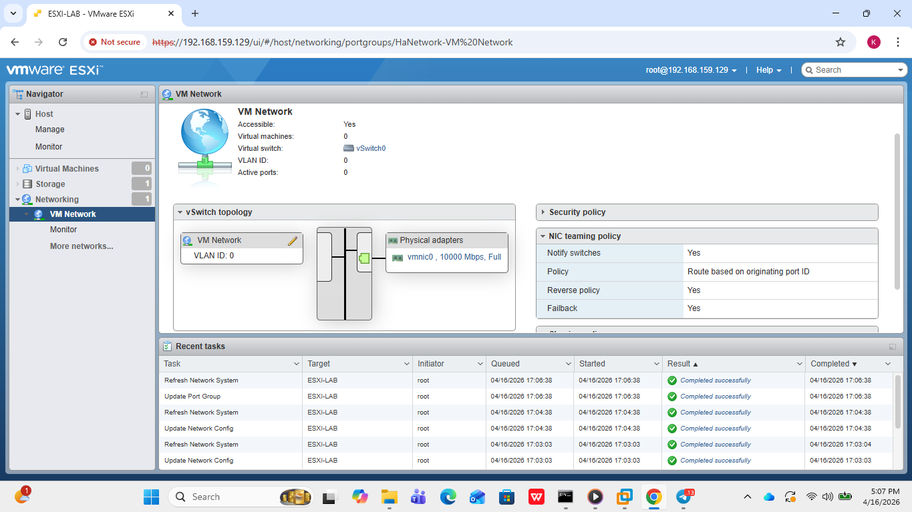
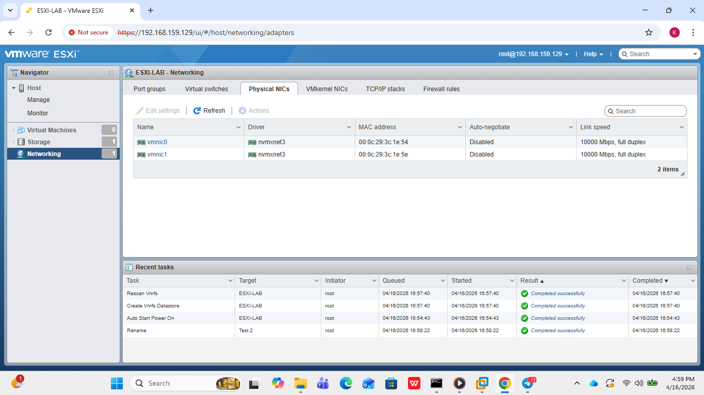
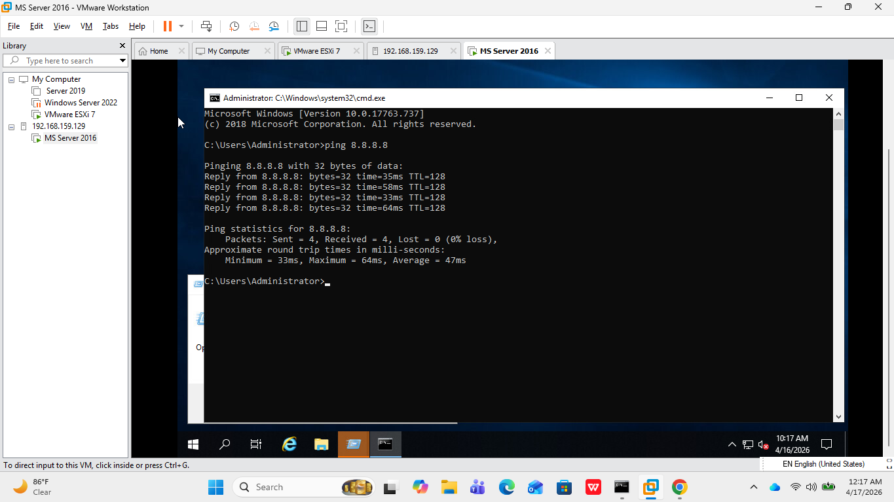

# vmware-esxi-lab
VMware Esxi 7.0 home lab setup with Windows Server 2016 VM, Virtual Networking and Storage configuration.Built for hands-on IT infrastructure practice.
# VMware ESXi Home Lab

## Overview
This is a home lab built using VMware Workstation and VMware ESXi 7.0 to practice IT infrastructure and virtualization skills.

## Lab Environment
- **Hypervisor:** VMware ESXi 7.0
- **Host:** ESXI-LAB (192.168.159.129)
- **CPU:** Intel Core i5-8250U @ 1.60GHz
- **RAM:** 4 GB

## Virtual Machines
| VM Name | OS | CPU | RAM | Storage |
|---|---|---|---|---|
| MS Server 2016 | Windows Server 2016 | 2 vCPU | 4 GB | 40 GB |

## Network Configuration
- vSwitch0 with VM Network and Management Network port groups
- vmnic0 and vmnic1 physical adapters

## Storage
- Datastore: Test 1 (255.75 GB, VMFS6)

## Skills Demonstrated
- VMware ESXi installation and configuration
- Virtual machine creation and management
- Virtual networking setup (vSwitch, Port Groups)
- Windows Server 2016 installation
- Network connectivity testing

## Screenshots

